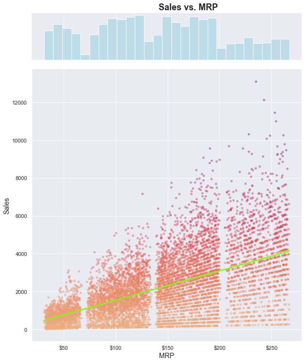
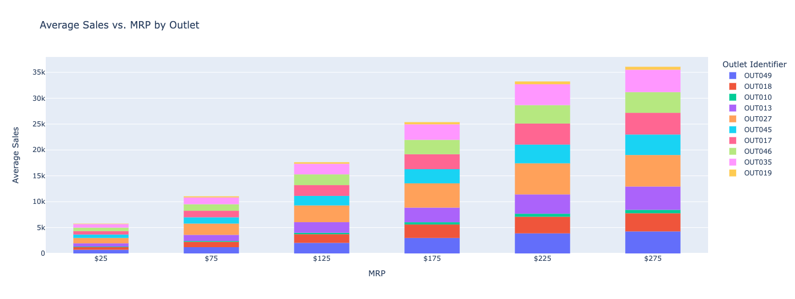

# Food Sales Predictions
## Interpretable decision-tree based model that predicts item sales based on item and outlet info

**Author**: Ankit Dey

### Business problem:

The purpose of this project is to create a model to predict item sales based on information about the item (e.g. MRP, weight) and the outlet where it is sold. This model can then be used to help understand how to drive growth in sales.

### Data:
Data was sourced from Big Mart's sales data in 2013, containing 1559 items sold across 10 outlets. The dataset contains 7 categorical variables and 5 numerical variables, all representing relevant information about an item or the outlet the item is sold in.

## Methods Used
- Data mining
- Data cleaning
  - Item_Weight and Outlet_Size columns were missing 17.2% and 28.3% of their rows, respectively. Item_Weight is a continuous numerical variable with no large outliers, so mean values were imputed in missing rows. Outlet_Size is an ordinal variable, so missing rows were imputed with the most frequent outlet size.
- Exploratory analyses to extract insights
- Machine Learning:
  - Predictive modeling (linear regression, decision tree)

## Key Insights

> Sales are positively correlated with MRP, even though fewer items have higher MRPs.

#

> OUT010 and OUT019 show low sales, while OUT027 shows high sales.

#

> OUT010 and OUT019 show low sales across the entire range of MRPs, while OUT027 shows high sales across the entire range

## Model

The final model is a decision tree with max_depth = 6 and min_samples_leaf = 51.

The model shows an R^2 of 0.60, a mean absolute error (MAE) of 735, and a root-mean squared error (RMSE) of 1056.

60% of the variance in item sales can be explained by the model based on the given item and outlet features. On average, the model is off by 735 sales with a residual standard deviation of 1056 sales.

## Recommendations:

- Increase the number of high-MRP (luxury) items for sale, since MRP is correlated with sales (consumers may prefer luxury items)
- End contracts with OUT010 and OUT019, since sales are very low at these outlets
- Push new luxury products to OUT027 first, since sales are highest at this outlet

## Limitations & Next Steps

A future project could explore the use of boosting to increase model complexity and reduce error without overfitting. Other regression models could also be tested, such as a random forest model. Although these changes may result in better predictions, they would reduce the interpretability of the final model.

### Contact

For further information, please contact **ankitkdey@gmail.com**
