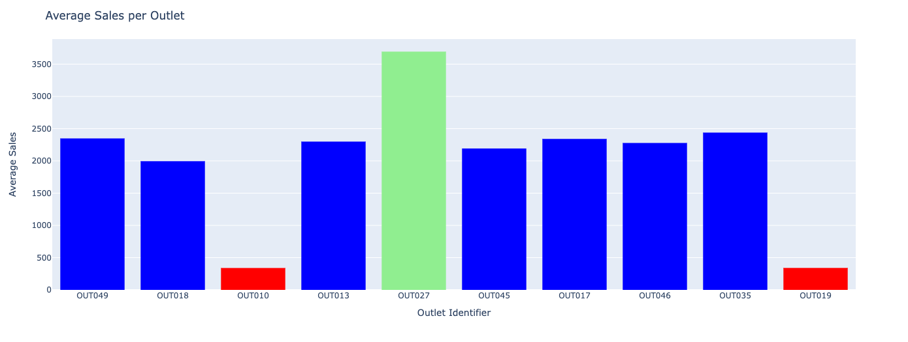

# Predicting item sales 
## Creating a model to predict item sales based on item and outlet info

**Author**: Ankit Dey

### Business problem:

The purpose of this project is to create a model to predict item sales based on information about the item (e.g. MRP, weight) and the outlet where it is sold. This model can then be used to help understand how to drive growth in sales.

### Data:
Data was sourced from Big Mart's sales data in 2013, containing 1559 items sold across 10 outlets. The dataset contains 7 categorical variables and 5 numerical variables, all representing relevant information about an item or its outlet.

## Methods Used
- Data mining
- Data cleaning
  - Item_Weight and Outlet_Size columns were missing 17.2% and 28.3% of their rows, respectively. Item_Weight is a continuous numerical variable with no large outliers, so mean values were imputed in missing rows. Outlet_Size is an ordinal variable, so missing rows were imputed with the most frequent outlet size.
- Exploratory analyses
- Machine Learning
- Predictive modeling (linear regression, decision tree)

## Key Insights

#### Sales vs. MRP

> Sales are positively correlated with MRP, even though fewer items have higher MRPs.

#### Sales by Outlet

> OUT010 and OUT019 show low sales, while OUT027 shows high sales.

#### Sales vs. MRP by Outlet

## Model

The final model is a decision tree with max_depth = 6 and min_samples_leaf = 51.

This model shows an R^2 of 0.60, a mean absolute error (MAE) of 735, and a root-mean squared error (RMSE) of 1056.

This model can explain 60% of the variance in item sales based on the given item and outlet features. On average, the model is off by 735 sales with a residual standard deviation of 1056 sales.

## Recommendations:

- Increase the number of high-MRP (luxury) items for sale, since MRP is correlated with sales (consumers may like luxury items)
- End contracts with OUT010 and OUT019, since sales are very low in these outlets
- Test new luxury products in OUT027, since sales are highest at this outlet

## Limitations & Next Steps

A future project could explore the use of boosting to increase model complexity and reduce MAE without overfitting. Other regression models could also be tested, such as a random forest model.

### For further information

For any additional questions, please contact **ankitkdey@gmail.com**
